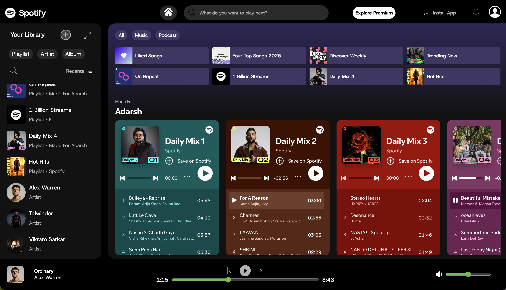

# Spotify-Clone

A Spotify-inspired front-end music interface built with HTML, CSS, and vanilla JavaScript.

This project recreates a modern music app layout with:
- A responsive top navigation bar
- A collapsible library sidebar
- Playlist and artist cards
- Embedded Spotify playlist frames
- A footer music player UI

## Screenshot



## Features

- Responsive layout for desktop, tablet, and mobile breakpoints
- Sidebar toggle + overlay behavior for smaller screens
- Active state switching for top filters (`All`, `Music`, `Podcast`)
- Active state switching for library tabs (`Playlist`, `Artist`, `Album`)
- Embedded Spotify playlist iframes for quick preview
- Custom footer player controls and progress/volume sliders (UI)

## Tech Stack

- HTML5
- CSS3 (modular files by section)
- JavaScript (ES6, DOM event handling)

## Project Structure

```text
Spotify/
├── index.html
├── script.js
├── styles.css
├── utility.css
├── navbar.css
├── cards.css
├── library.css
├── libraryplaylist.css
├── frames.css
├── icons/
├── images/
└── readme.md
```

## Getting Started

1. Clone or download this repository.
2. Open the project folder in VS Code.
3. Run `index.html` in your browser.

Recommended:
- Use the VS Code Live Server extension for auto-reload during development.

## How It Works

- `index.html` defines the page structure (navbar, library, content, embeds, footer player).
- CSS is split into focused files for easier styling and maintenance.
- `script.js` handles interactive behavior:
	- tab/button active class management
	- library open/close behavior
	- overlay click-to-close behavior

## Notes

- The footer player is currently a visual UI component and does not include real audio playback logic.
- Playlist content and images are static and can be replaced with your own data.

## Future Improvements

- Connect the player UI to real audio playback
- Add search/filter functionality for playlists and artists
- Generate cards dynamically from JSON or an API
- Add keyboard accessibility and ARIA enhancements

## Author

Adarsh Panchal
